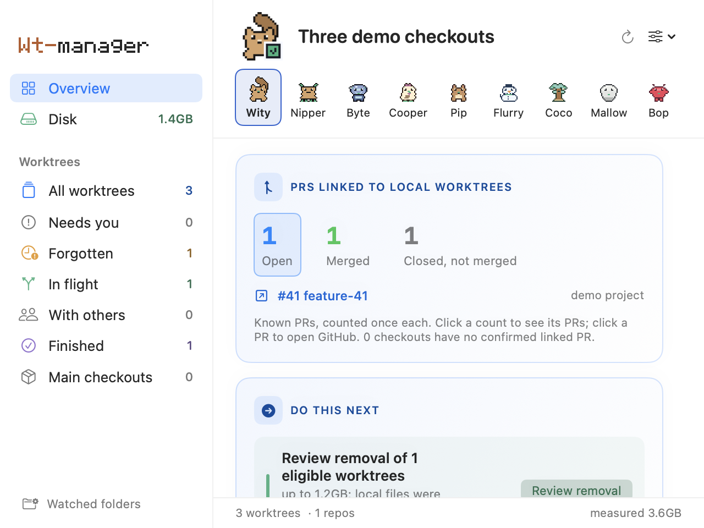
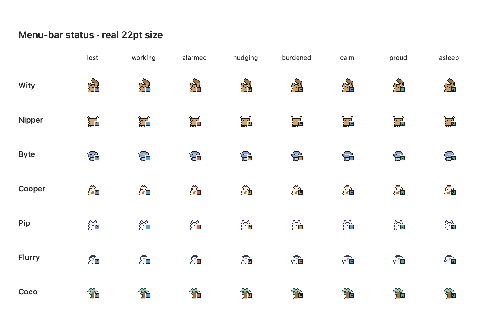
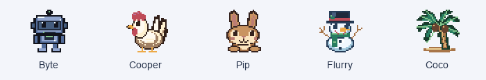
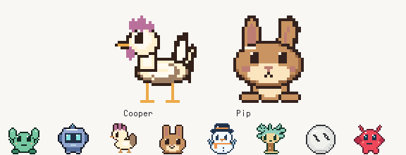

<div align="center">

# wt-manager

**Too many worktrees. Too much disk. One clear next step.**

A native macOS menu-bar companion for developers working across Git branches, projects, and coding agents.

[Install](#install) · [How it works](#your-first-five-minutes) · [Safety](#cleanup-with-a-review-first) · [CLI](#the-same-tool-in-your-terminal)


</div>

A Git worktree is another checkout of a repository, with its own files and branch. It makes parallel work easy. It also makes it easy to forget a finished branch, leave a dependency folder behind, or lose track of work that exists only on your laptop.

wt-manager answers three questions:

- **What needs me?** See active work, review requests, failing checks, forgotten branches, and finished checkouts.
- **Where did my space go?** Measure checkout sizes, find rebuildable output, and watch disk usage change between full scans.
- **What can I safely clean?** Review the exact paths first. Keep work at risk in place. Preserve protected files before removing eligible worktrees.

No hosted account. No subscription. A Python standard-library engine, a native SwiftUI app, and a pixel companion that lives in your menu bar.

## Install

### Download the app — Apple Silicon

1. Download `wt-manager-macos-arm64.zip` from the [latest release](https://github.com/samiesmilz/wt-manager/releases/latest).
2. Unzip it and move **wt-manager.app** into **Applications**.
3. Open the app. Choose the folders containing your repositories.

You need **macOS 13 or later**, **Git**, and **Python 3.9 or later**. The app looks for Python in the standard Apple and Homebrew locations. It does not bundle a Python runtime. GitHub pull-request enrichment is optional and requires the [GitHub CLI](https://cli.github.com/) signed into accounts that can read your repositories.

This initial release is **ad-hoc signed, not Apple notarized**. macOS may ask you to approve opening it in System Settings → Privacy & Security. If you prefer building the code yourself, use the source installation below. Intel Macs can build from source; the downloadable binary is for Apple Silicon.

The downloaded app starts when you open it. To launch it at login, add it in System Settings → General → Login Items. Source installation can configure this for you.

### Build from source

Install Xcode Command Line Tools (or Xcode with a Swift 5.9+ toolchain), Git, and Python 3.9+. Then:

```sh
git clone https://github.com/samiesmilz/wt-manager.git
cd wt-manager
make install
```

This builds the app, installs it into `/Applications`, links the CLI at `~/.local/bin/wt-manager`, and registers a login item. Add `~/.local/bin` to your shell's `PATH` if it is not already there.

To install without launching at login:

```sh
LOGIN=0 make install
```

The app and CLI share the engine inside the installed bundle, so they use the same safety rules.

## Your first five minutes

1. **Choose watched folders.** Select a parent such as `~/dev`. wt-manager searches up to three directory levels deep for repositories.
2. **Read Overview.** Get the next useful action, project summaries, and work that exists only on this machine.
3. **Open Disk.** See space per repository, rebuildable output, and the latest measured growth. The first full scan can take a few minutes; counts appear first and disk measurement runs behind them.
4. **Review cleanup.** Read the exact paths and preservation details. Nothing is deleted during the preview.
5. **Confirm deliberately.** Only confirmed completions earn reclaimed-space credit. Results remain available after the modal closes.

The sidebar separates **Needs you**, **Forgotten**, **In flight**, **With others**, **Finished**, and **Main checkouts**. Filter by repository or branch, expand a checkout for details, or hand work off to Terminal, Finder, or its pull request.

“Finished” describes branch history. It does not automatically mean “safe to delete.” A checkout with local changes or another known blocker explains why removal is unavailable. Unchecked checkouts offer inspection first.

## Cleanup with a review first

wt-manager has two different actions:

| Action | What changes | What stays |
|---|---|---|
| **Clean build output** | Recognized rebuildable folders such as dependency/build output | The checkout, environment files, keys, and unrecognized files |
| **Remove eligible worktrees** | Finished, eligible extra checkouts via `git worktree remove` | Work at risk; verified copies of protected local files |

Removal checks local changes, unpushed work, base resolution, locks, submodules, and unknown-file size. Primary/base checkouts are kept. Protected ignored files, such as environment files, are copied to `~/.local/share/wt-manager/kept/` and verified byte for byte before removal. Recognized output containing protected descendants preserves those descendants without archiving the whole build folder. Truly unclassified data over the backup limit (100 MB) blocks removal.

The preview and confirmation are bound to the same reviewed set. If that set changes, the operation asks for another review. Execution can still refuse if permissions, files, or Git state change. A Git warning about skipped directories, or a failed status command, blocks cleanup/removal for that checkout and is shown in the preview; overrides do not bypass an incomplete inventory. Partial results list only confirmed completions and show what failed.

**Deletion is consequential.** Preserved local files are not a full checkout backup. Read the preview and keep your own backups. Rebuildable output must be installed or built again.

## Make space. Get a little celebration.


Your **Space** card tracks local progress:

- Estimated reclaimed space and confirmed cleanup count.
- Badges at **1, 5, 25, 100, and 500 GiB**, from **Space Scout** to **Space Legend**.
- Watched-checkout size, rebuildable space, and change since the previous full measurement.
- A compact history line for the last 48 full scans.

A successful cleanup in the app triggers a short burst of pixel sparks. Partial successes earn credit for confirmed reclaimed space but keep warning feedback prominent. Failed operations and previews earn nothing. There are no streak penalties or leaderboards. Badge credit is recorded for cleanups performed through the native app; CLI changes appear in subsequent disk measurements.

Measurements and rewards stay on your Mac. Changing watched folders resets the comparison baseline so a different scope does not appear as disk growth. Figures are estimates from the engine, not a filesystem quota or a promise of exact free-space changes. Sparse files, shared objects, and rebuilds can affect actual disk use.

Turn effects off in **Appearance → Cleanup celebrations**. macOS **Reduce Motion** disables the particle burst and mascot motion; readable completion feedback stays.

## PR intelligence

Overview counts **known PRs linked to local worktrees**, with separate Open, Merged, and Closed-not-merged counters. One PR counts once even when several checkouts reference it. Unconfirmed checkouts and GitHub access warnings stay visible; these are not repository-wide or lifetime totals. Closed PRs are associated only when their head commit matches the local checkout. Historic query limits can leave older PRs unconfirmed.

**Click an Open, Merged or Closed counter to see its linked PRs**, then click a PR number and title to open it on GitHub. Open PRs appear immediately. Titles fall back to the local branch name while older cached data refreshes. Merge messages also offer **Open PR**.

After wt-manager has observed a PR open, a later verified merge produces a mascot speech message. It appears in the window, or beside the floating companion when the window is closed. **Review checkout** opens the engine's safety preview; merging a PR never automatically deletes files. New local commits, protected files, locked worktrees and unreadable folders can still prevent removal. Occupied disk space is labelled separately from safely reclaimable space.

The first scan quietly establishes a baseline. Messages and dismissals persist locally, partial scans preserve known state, and duplicate checkouts do not duplicate alerts. Turn them off using **Appearance → Mascot merge messages**. PR reads use your existing `gh` session and short local caches; detection follows periodic refreshes, rather than real-time GitHub push events.



## Meet the pixel crew

The seven new companions have separate **32×32 drawings**, shown at **64×64pt** on the desktop. Their menu-bar versions use separate 22px portraits with larger facial features and no framed badge. Wity retains its original silhouette. Cooper has a slim neck, longer legs and alternating toe lifts; Pip has a softer face and simpler muzzle. Detailed art adds shading, accessories and individual part animations without enlarging the floating window. Pip’s default coat is warm chestnut; saved coats remain available.

You can also let the floating companion take occasional screen strolls from **Appearance → Let the mascot wander**. This is off by default. Each character uses a gait suited to its shape: for example, the rabbit hops, the palm sways its crown, and the little machines alternate their steps. The companion pauses between short walks, turns to face its direction, then returns to the position you chose. Clicking or dragging stops it at once. Wandering pauses while the wt-manager window is open or a merge message is waiting, and macOS Reduce Motion pauses all movement. The walking frames run only while travelling; macOS eases the window between destinations.


| Companion | Personality |
|---|---|
| **Wity** | The original cat, with a plume and status collar |
| **Nipper** | A crab with snapping claws and tiny legs |
| **Byte** | An original slate robot with a visor, scanning signal lights, and a small smile |
| **Cooper** | A rooster with a plum comb, warm beak, and a double peck |
| **Pip** | A chestnut rabbit with a cream muzzle, folding ear and little paws |
| **Flurry** | A snowman with a top hat, waving twig hand, carrot nose, and fluttering scarf |
| **Coco** | A palm tree with swaying fronds and coconuts |
| **Mallow** | A limbless pearl orb with slanted eyes and a rolling highlight |
| **Bop** | A red antenna character with rounded side arms, short feet and a wave |

The character is decoration; its framed status badge is the instrument. On the desktop and in the window, every character uses the same badge size, colour field, high-contrast borders, and distinct glyph for each of eight moods. The larger signal stays readable on light and dark backgrounds, and changing character does not change its meaning. Characters share a baseline, while Byte now has a compact body and a lighter slate coat. Coco's coconuts no longer cover its expression.



Each companion has its own idle gesture: Byte scans its signal lights, Cooper nods and alternates toe lifts, Pip flops its ears, Flurry waves and flutters its scarf, and Coco changes its frond shapes in the breeze. Cooper keeps one foot grounded while stepping; the other companions keep their bodies planted. Reduce Motion freezes the gestures.



Choose a character with **one click on its portrait beneath the window headline**. The selected portrait is highlighted. Clicking the large header mascot cycles to the next character. Coats are available in **Appearance**. You can also use your own picture, reduced to the same pixel grid and stored locally.



**The menu-bar mascot stays clean, without the arrow/status badge; the attention count still appears beside it.** Full status badges remain on larger mascots, and the menu-bar tooltip explains current status.

**Click the desktop or menu-bar mascot to open wt-manager immediately.** Right-click either mascot for less frequent actions, including Quit. The compact floating desktop mascot is shown by default. Drag it anywhere without opening the window; its position survives restarting the app. Right-click the large header mascot for coat, update and Quit actions. Hide/show the desktop companion using **Appearance → Show floating mascot** or its right-click menu. **Reset mascot position** brings it back if needed. It stays available when you close the main window and follows your Mac's Spaces. Saved positions are recovered onto a connected display when the display layout changes.

The menu-bar mascot also offers Open window, Refresh, Watched folders, updates, and Quit. Quit is unavailable while a destructive operation is running. Closing the window leaves the menu-bar companion running; quitting stops the app until you open it again or the next configured login launch.

## Updates

Automatic update checks are **off by default**. Enable **Appearance → Check updates automatically** to check this repository's latest stable GitHub release at launch and then no more than once a day after a successful check. An existing explicitly saved preference is retained. A new version appears in a dismissible banner with a link to the release and installation instructions. You can always check manually from either mascot menu or Appearance.

Updates are **announced, not silently installed**. To update a downloaded app, quit wt-manager and replace it with the new download. For a source install, update your checkout and run `make install` again. Settings and local reward history survive replacement.

Turn automatic checks off in **Appearance → Check updates automatically**. Checks contact GitHub's public release API without an authentication token or repository data. GitHub receives ordinary network metadata such as your IP address and the installed app version. Offline or failed checks are shown honestly when requested manually; they do not erase a previously discovered update.

## The same tool in your terminal

For a source installation, the CLI is linked automatically. For a downloaded app, optionally link its embedded engine:

```sh
mkdir -p "$HOME/.local/bin"
ln -sf /Applications/wt-manager.app/Contents/Resources/engine/wtmanager.py "$HOME/.local/bin/wt-manager"
```

Add `~/.local/bin` to your `PATH`, then:

```sh
wt-manager                    # work across watched repositories
wt-manager --all              # include finished and primary checkouts
wt-manager --here              # just the current repository
wt-manager size                # measure checkout and rebuildable sizes
wt-manager doctor              # explain base resolution and forge access
wt-manager --json              # machine-readable inventory
wt-manager clean               # preview rebuildable-output cleanup
wt-manager reap                # preview eligible worktree removal
```

Explicitly act on a checkout after reviewing it:

```sh
wt-manager clean --path /path/to/worktree --yes
wt-manager reap --path /path/to/worktree --yes
```

For scripts, bind confirmation to the preview hash with `--json` and `--plan HASH`. Read `wt-manager --help`, `wt-manager clean --help`, and `wt-manager reap --help` for the complete options, including advanced overrides. The app uses the conservative defaults.

Configure folders and bases:

```sh
wt-manager config --init
wt-manager config --roots ~/dev --roots ~/projects
wt-manager config --clear-cache
```

## What is read, stored, and sent

- **Git repositories:** local refs, status, worktree metadata, and directory sizes. wt-manager never performs `git fetch` or changes a branch's history.
- **GitHub PRs:** optional queries through `gh`. Multiple signed-in accounts are tried per repository without changing your active CLI account. Without `gh`, local Git inventory still works.
- **Update checks:** the public release endpoint for this project. No scanned paths, branch names, disk measurements, reward data, or PR data are included in update requests.
- **Local settings:** watched folders/base pins under `~/.config/wt-manager/`; caches under `~/.cache/wt-manager/`; preserved files under `~/.local/share/wt-manager/kept/`; native appearance, rewards, and measurements in app preferences. Custom images live in Application Support.

Counts refresh about every five minutes, disk measurements about hourly. Opening the window catches up on stale counts. Cached sizes can lag changes outside the app; Refresh requests a full measurement. Duplicate/shared repository content means summed checkout estimates are not an exact measure of unique physical bytes.

## Shortcuts and lifecycle

| Shortcut | Action |
|---|---|
| `⌘R` | Refresh and measure disk |
| `⌘F` | Find a checkout |
| `⌘,` | Watched folders |
| `⌘1`–`⌘9` | Navigate sections |

From a source checkout:

```sh
make stop         # stop until explicitly started or the next login
make start        # launch again
make login-off    # disable launch at login
make login-on     # enable launch at login
make uninstall    # remove app, CLI link, and login item
```

Uninstall intentionally leaves settings, caches, reward history, and preserved files. Backups are yours to retain or remove. `wt-manager config --clear-cache` only clears the engine's caches.

## Development

```sh
python3 -m unittest -q test_wtmanager
swift test --package-path app
make bundle
make snapshots
```

The native render harness covers light/dark appearance, normal/minimum window sizes, setup, every section, safety/refusal states, progress, success, and partial failures. Documentation screenshots use fictional projects. Accessibility support includes named controls, keyboard shortcuts, persistent text results, and Reduce Motion; a complete VoiceOver certification has not been performed.

See [CONTRIBUTING](CONTRIBUTING.md) for development and [RELEASING](RELEASING.md) for publishing a release. Report reproducible bugs through [Issues](https://github.com/samiesmilz/wt-manager/issues). When reporting cleanup problems, redact private paths and file contents.

## License

[MIT](LICENSE). Built by [Samuel Abinsinguza](https://github.com/samiesmilz).
